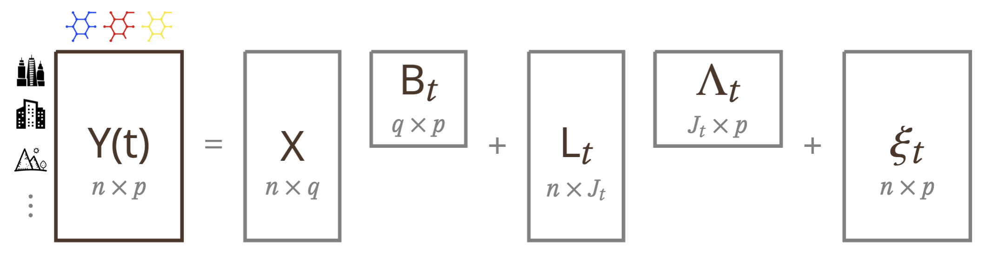
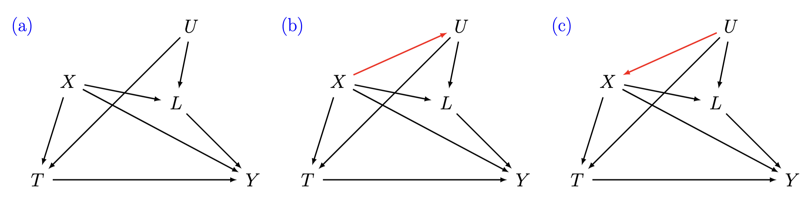

```{r setup, echo=FALSE}
knitr::opts_chunk$set(
	fig.align = "center",
	warning = FALSE,
	comment = NA,
	dev = "png",
	dpi = 150
)
```

Import libraries

```{r message=FALSE, warning=FALSE}
library(statmod)
library(plot.matrix)
library(matlab)
library(R.matlab)
library(MASS)
library(mvtnorm)
library(MatrixCorrelation)
library(parallel)
library(ggplot2)
library(dplyr)
library(forcats)
library(hrbrthemes)
library(viridis)
```

Import Gibbs sampler for Causal Factor Regression

```{r echo=FALSE, message=FALSE, warning=FALSE}
load("~/Documents/GitHub/BayesCausalFactor/R/results/simulations_results.RData")
load("~/Documents/GitHub/BayesCausalFactor/Data/results_application_00.RData")
```


```{r message=FALSE, warning=FALSE}
setwd("/Users/dafnezorzetto/Documents/GitHub/CausalFA/src")
source("simulation_functions.R")
source("2_causal_fa_Lt_X.R")
source("10_causal_fa_Lt_stand_mixfree_reg.R")
source("bart_bcf.R")
source("code_parallelized.R")
source("plots_functions.R")
```


### Causal Factor Model



-   $X$ observed confounders
-   Prior for regression coeff.: $\beta_{jt} \sim N_q (\mu_\beta, \Sigma_\beta)$ for$i \in \{1, \dots, n\}$ and $t\in \{0,1\}$
-   Treatment-specific factors scores: (DDP) $$l_{itj} \sim \sum_{r \geq 1}\pi_{tjr}(x_i)N(\mu_r,\sigma_r^2)$$ $$\pi_{tjr}(x_i) = V_{tjr}(x_i)\prod_{g<r}[1-V_{tjg}(x_i)]$$
-   Treatment-specific factors loadings: (Bhattacharya and Dunson, 2011) $$\lambda_{tj h} \mid \kappa_{t j h}, \iota_{th} \sim N\left(0, \kappa_{tj h}^{-1} \iota_{th}^{-1}\right)$$ with $\kappa_{t j h} \sim Ga(\nu_t / 2, \nu_t / 2)$ and $\iota_{h}=\prod_{l=1}^{h} \delta_{tl} \quad \delta_{t1} \sim Ga\left(a_{t1}, 1\right) \quad \delta_{tl} \sim Ga\left(a_{t2}, 1\right)$
-   Error matrix: $\xi_{it} \sim N_p (0, \mbox{diag}(\psi_{i1t}, \dots, \psi_{ipt}))$

### Settings

We have four settings. three to evaluate the unmeasure varible and one that mimics the data.

-   The first three settings. Each of them has $n=500$ units, $p=10$ predictors/outcomes, and $J_t=3$ factors (for both treatment levels $t$).

Corresponding to 3 case in the following figure:



-   **Setting 1:**
    -   4 confounders: $X_1 \sim N(0,1)$, $X_2 \sim N(1,1)$, $X_3 \sim Be(0.3)$, and $X_4 \sim Be(0.6)$
    -   unmeasured var: $U \sim N(0,2)$
-   **Setting 2:**
    -   4 confounders: $X_1 \sim N(0,1)$, $X_2 \sim N(1,1)$, $X_3 \sim Be(0.3)$, and $X_4 \sim Be(0.6)$
    -   unmeasured var: $U \sim N(0.5 + X_1 + 0.5X_3,0.5)$
-   **Setting 3:**
    -   unmeasured var: $U \sim N(0,2)$
    -   4 confounders: $X_1 \sim N(0.4U,1)$, $X_2 \sim N(1-0.3U,1)$, $X_3 \sim Be(0.3)$, and $X_4 \sim Be(0.6)$

Then each of them has in common the following data generation process:

-   treatment variable: $T \sim Be(expit(0.2 + 0.5X_1+0.2X_3-0.5U))$

-   factor loadings (for each $t$): $\Lambda_t$ is $10\times 3$ matrix with $25\%$ of zeros entries and the remain values with values between $[-1,-0.8]$ and $[0.8,1]$

-   error matrix (for each $t$): $\xi_{it} \sim Unif_p[0,1]$

-   categorical variable for each unit $i$ and for different treatment level $t$ and factor $j$: $C_{ijt}$ depend on variable $X_3$ and $X_4$ (no dependence with $U$)

-   factor score: $l_{itj} \mid C_{ijt}=c \sim N(\mu_{t,c}+\gamma_{t,c}U, 1)$

-   potential outcome: \$Y(t) \sim B_tX +\Lambda\_t\eta + \xi\_t \$

-   **Setting 4:**

    -   we use the 3426 units of the data application (monitor-day)
    -   treatment is the observed treatment
    -   28 observed covariated
    -   factor loading are the estimated factor loadings with our models (3 factors)
    -   different custers as for the previous simulated settings but by real covarites

```{r functions_sim, eval=TRUE, message=FALSE, warning=FALSE}
# options for X generation
X_indep_function<-function(n_obs){
  return(X = rbind(rnorm(n_obs,0,1),
                   rnorm(n_obs,1,1),
                   rbinom(n_obs,1,0.3),
                   rbinom(n_obs,1,0.6)))
}
X_depU_function<-function(n_obs, U){
  return(X = rbind(rnorm(n_obs,0.4*U,1),
                   rnorm(n_obs,1-0.3*U,1),
                   rbinom(n_obs,1,0.3),
                   rbinom(n_obs,1,0.6)))
}
# options for U generation
U_indep_function<-function(n_obs){
  return(U = rbind(rnorm(n_obs,0,2)))
}
U_depX_function<-function(n_obs, X){
  return(U = rbind(rnorm(n_obs,0.5+X[,1]+0.5*X[,3],2)))
}

# generatoin data mechanism
funct_data_generating<-function(n_tot, p,
                                lim_nozeros_Lambda, perc_nozeros_Lambda,
                                setting_XU, mean_cl, c_U, seed){
                        
  set.seed(seed)
  
  # useful variables 
  X_t  <- U_t <- list()
  l_all <- Y_all <- list()
  Psi_t <- Y_t <- l_t <- beta_t <- list()
  Y_mis <- l_mis <- list()
  
  # X and U: different settings
  if (setting_XU==1){
    X <- X_indep_function(n_tot)
    U <- U_indep_function(n_tot)} 
  if(setting_XU==2){
    X <- X_indep_function(n_tot)
    U <- U_depX_function(n_tot,X)} 
  if(setting_XU==3) {
    U <- U_indep_function(n_tot)
    X <- X_depU_function(n_tot, U)}
  
  # treatment
  reg_T <- c(-0.2 + c(0.5,0.2)%*%X[c(1,3),] -0.4*U)
  Treat <- rbinom(n_tot,1,exp(reg_T)/(1+exp(reg_T)))
  
  # cluster allocation
  j_t <- sapply(mean_cl,function(x) length(x))
  cl_alloc <- list(matrix(NA,n_tot,j_t[1]),matrix(NA,n_tot,j_t[2]))
  
  for (s in 0:1){
    for (j in 1:j_t[s+1]){
      n_cl=length(mean_cl[[s+1]][[j]])
      if(n_cl==1){
        cl_alloc[[s+1]][,j] <- 1
      }
      if(n_cl==2){
        cl_tr <- rep(2,n_tot)
        cl_tr[(X[1,])>0] <- 1
        cl_alloc[[s+1]][,j] <- cl_tr
      }
      if(n_cl==3){
        cl_tr <- rep(3,n_tot)
        cl_tr[(X[3,])>0] <-1
        cl_tr[((X[1,]+0.2)*(1-X[3,]))>0] <-2
        cl_alloc[[s+1]][,j] <- cl_tr
      }
    }
  }
  
  # factor loadings
  Lambda_t <- funct_specific_factors(p, j_t, 
                                     no_zeros=lim_nozeros_Lambda, 
                                     perc_nozeros=perc_nozeros_Lambda)
  
  for(s in 1:2){
    # errors
    Psi_t[[s]] = diag(runif(p,0,1), p)    
    
    #covariates 
    betas <- seq(-2+(s-1)*0.5,1-(s-1)*0.5,length.out=4*p)
    beta_t[[s]] = matrix(betas, nrow=p, ncol=4, byrow=TRUE)
    
    # treatment-specific factors
    l_all[[s]] <- sapply(1:j_t[s], function(j) rnorm(n_tot, 
                                                  mean_cl[[s]][[j]][cl_alloc[[s]][,j]]+
                                                  c_U[[s]][[j]][cl_alloc[[s]][,j]]*U,1))
    
    # Y regression 
    Y_all[[s]] <- t(beta_t[[s]]%*%X) + l_all[[s]]%*%t(Lambda_t[[s]]) + 
      mvrnorm(n_tot, rep(0, p), Psi_t[[s]])
  }
  
   # division "observed" and "missing" outcome
  for(s in 1:2){
    X_t[[s]] <- X[ ,Treat==(s-1)]
    U_t[[s]] <- U[ ,Treat==(s-1)]
    Y_t[[s]] <- Y_all[[s]][Treat==(s-1), ]
    l_t[[s]] <- l_all[[s]][Treat==(s-1), ]
    Y_mis[[s]] <- Y_all[[s]][Treat==(2-s), ]
    l_mis[[s]] <- l_all[[s]][Treat==(2-s), ]
 }
  
  return(list(data=list(n_t = c(length(U_t[[1]]),length(U_t[[2]])), 
                        Y_t = Y_t, Treat = Treat, X_t = X_t, U_t=U_t),
              factors=list(Lambda_t = Lambda_t, 
                           Psi_t = Psi_t, l_t = l_t),
              parameters=list(j_t = j_t, cl_alloc = cl_alloc, 
                              mean_cl = mean_cl),
              mis_data=list(Y_mis = Y_mis,  l_mis = l_mis, Y_all=Y_all)))
  
}

# generatoin data mechanism
funct_dataapplication_generating<-function(dataset, mean_cl, seed, factors){
                        
  set.seed(seed)
  n_tot=dim(dataset)[1]
  p = 27
  
  # treatment
  Treat <- dataset$treat
  # covariates
  X <- dataset[,31:57]
  X$monitor <- 1*(X$monitor=="CSN")
  X$rural <- 1*(X$rural=="Mix") + 2*(X$rural=="Urban")
  X$aug <- 1*(X$month==8)
  X$sept <- 1*(X$month==9)
  X <- X[,-27]
  X[,c(1:2,5:26)] <- scale(X[,c(1:2,5:26)])
  X <- t(X)
  d_X <- dim(X)[1]
  
  # factor loading
  Lambda_t <- list()
  for (i in 1:2){
    eigenPhi <- eigen(factors[[i]])
    loadK <- varimax(eigenPhi$vectors[,1:3])$loadings
    Lambda_t[[i]]<- loadK[1:27,]
  }
  
  # factor scores
  # cluster allocation
  j_t <- sapply(mean_cl,function(x) length(x))
  cl_alloc <- list(matrix(NA,n_tot,j_t[1]),matrix(NA,n_tot,j_t[2]))
  cl_alloc[[1]][,1] <- 1 +1*(X[3,]!=0)+1*(X[4,]!=0)
  cl_alloc[[1]][,2] <- 1 +1*(X[1,]>0)
  cl_alloc[[1]][,3] <- 1 +1*(X[2,]>0)
  
  cl_alloc[[2]][,1] <- 1 +1*(X[26,]!=0) +1*(X[27,]!=0)
  cl_alloc[[2]][,2] <- 1 +1*(X[8,]>0)
  cl_alloc[[2]][,3] <- 1 +1*(X[1,]>0) +1*(X[2,]>0)
  
  # variables definition
  l_all <- Y_all <- list()
  X_t <- Psi_t <- Y_t <- l_t <- beta_t <- list()
  Y_mis <- l_mis <- list()
  
  for(s in 1:2){
    # errors
    Psi_t[[s]] = diag(runif(p,0,1), p)    
    
    #covariates 
    betas <- seq(-3+(s-1),2+(s-1),length.out=d_X*p)
    beta_t[[s]] = matrix(betas, nrow=p, ncol=d_X, byrow=TRUE)
    
    # treatment-specific factors
    l_all[[s]] <- sapply(1:j_t[s], function(j) rnorm(n_tot, 
                                                  mean_cl[[s]][[j]][cl_alloc[[s]][,j]],1))
    
    # Y regression 
    Y_all[[s]] <- t(beta_t[[s]]%*%X) + l_all[[s]]%*%t(Lambda_t[[s]]) + 
      mvrnorm(n_tot, rep(0, p), Psi_t[[s]])
  }
  
   # division "observed" and "missing" outcome
  for(s in 1:2){
    X_t[[s]] <- X[ ,Treat==(s-1)]
    Y_t[[s]] <- Y_all[[s]][Treat==(s-1), ]
    l_t[[s]] <- l_all[[s]][Treat==(s-1), ]
    Y_mis[[s]] <- Y_all[[s]][Treat==(2-s), ]
    l_mis[[s]] <- l_all[[s]][Treat==(2-s), ]
 }
  
  return(list(data=list(n_t = c(length(X_t[[1]]),length(X_t[[2]])), 
                        Y_t = Y_t, Treat = Treat, X_t = X_t),
              #factors=list(Lambda_t = Lambda_t, 
              #             Psi_t = Psi_t, l_t = l_t),
              #parameters=list(j_t = j_t, cl_alloc = cl_alloc, 
              #                mean_cl = mean_cl),
              mis_data=list(Y_mis = Y_mis,  l_mis = l_mis, Y_all=Y_all)))
  
}

```

```{r n_sample, eval=TRUE, message=FALSE, warning=FALSE}
# number of samples
n_sample = 25
dim_Y = 10
n_units = 500
```

```{r simulation_settings, eval=FALSE, message=FALSE, warning=FALSE}
mu_eta <- list(list(c(-4,0,4),c(-3,3),c(-2,2)),
                 list(c(-5,0,5),c(-3,3),c(-2,0,2)))
gamma_U <- list(list(c(-0.5,0,0.5),c(-0.5,0.5),c(-0.2,0.2)),
                 list(c(-0.5,0,0.5),c(-0.5,0.5),c(-0.2,0,0.2)))

# setting 1:
data_1 <- lapply(1:n_sample, function(x) funct_data_generating(
                   n_tot=n_units, p=dim_Y, seed=x, 
                   lim_nozeros_Lambda=0.8, perc_nozeros_Lambda=0.75,
                   mean_cl=mu_eta, c_U=gamma_U, setting_XU=1))

# setting 2:
data_2 <- lapply(1:n_sample, function(x) funct_data_generating(
                   n_tot=n_units, p=dim_Y, seed=x, 
                   lim_nozeros_Lambda=0.8, perc_nozeros_Lambda=0.75,
                   mean_cl=mu_eta, c_U=gamma_U, setting_XU=2))

# setting 3:
data_3 <- lapply(1:n_sample, function(x) funct_data_generating(
                   n_tot=n_units, p=dim_Y, seed=x, 
                   lim_nozeros_Lambda=0.8, perc_nozeros_Lambda=0.75,
                   mean_cl=mu_eta, c_U=gamma_U, setting_XU=3))

# setting 4:
data_4 <- lapply(1:20, function(x) funct_dataapplication_generating(
                   dataset = def_dataset, mean_cl=mu_eta,
                   seed=x, factors=model_00_paper$sigma))
```

# Estimation model

```{r estimation_models, eval=FALSE, message=FALSE, warning=FALSE}
# setting 1:
model_1_mix <- mclapply(data_1, parallel_fa_Lt_mixfree_reg_allX, mc.cores = 5) 
model_1_lessF <- mclapply(data_1, parallel_mixfree_nfactors, factors=c(1,1), mc.cores = 5) 
model_1_moreF <- mclapply(data_1, parallel_mixfree_nfactors, factors=c(5,5), mc.cores = 5) 
model_1_stand <- mclapply(data_1, parallel_funct_causal_fa_Lt_X, mc.cores = 5)
model_1_bart <- mclapply(data_1, parallel_funct_bart, mc.cores = 5)
model_1_bcf <- lapply(1:n_sample, function(x) BCF_estimation(Y_t = data_1[[x]]$data$Y_t, 
                                                              X_t = data_1[[x]]$data$X_t, 
                                                              Treat = data_1[[x]]$data$Treat))

# setting 2:
model_2_mix <- mclapply(data_2, parallel_fa_Lt_mixfree_reg_allX, mc.cores = 5) 
model_2_lessF <- mclapply(data_2, parallel_mixfree_nfactors, factors=c(1,1), mc.cores = 5) 
model_2_moreF <- mclapply(data_2, parallel_mixfree_nfactors, factors=c(5,5), mc.cores = 5) 
model_2_stand <- mclapply(data_2, parallel_funct_causal_fa_Lt_X, mc.cores = 5)
model_2_bart <- mclapply(data_2, parallel_funct_bart, mc.cores = 5)
model_2_bcf <- lapply(1:n_sample, function(x) BCF_estimation(Y_t = data_2[[x]]$data$Y_t, 
                                                              X_t = data_2[[x]]$data$X_t, 
                                                              Treat = data_2[[x]]$data$Treat))

# setting 3:
model_3_mix <- mclapply(data_3, parallel_fa_Lt_mixfree_reg_allX, mc.cores = 5)
model_3_lessF <- mclapply(data_3, parallel_mixfree_nfactors, factors=c(1,1), mc.cores = 5) 
model_3_moreF <- mclapply(data_3, parallel_mixfree_nfactors, factors=c(5,5), mc.cores = 5) 
model_3_stand <- mclapply(data_3, parallel_funct_causal_fa_Lt_X, mc.cores = 5)
model_3_bart <- mclapply(data_3, parallel_funct_bart, mc.cores = 5)
model_3_bcf <- lapply(1:n_sample, function(x) BCF_estimation(Y_t = data_3[[x]]$data$Y_t, 
                                                              X_t = data_3[[x]]$data$X_t, 
                                                              Treat = data_3[[x]]$data$Treat))

# setting 4:
model_4_mix <- mclapply(data_4, parallel_fa_Lt_mixfree_reg_allX, mc.cores = 3)
model_4_lessF <- mclapply(data_4, parallel_mixfree_nfactors, factors=c(1,1), mc.cores = 3) 
model_4_moreF <- mclapply(data_4, parallel_mixfree_nfactors, factors=c(5,5), mc.cores = 3) 
model_4_stand <- mclapply(data_4, parallel_funct_causal_fa_Lt_X, mc.cores = 3)
model_4_bart <- mclapply(data_4, parallel_funct_bart, mc.cores = 3)
model_4_bcf <- lapply(1:n_sample, function(x) BCF_estimation(Y_t = data_4[[x]]$data$Y_t, 
                                                              X_t = data_4[[x]]$data$X_t, 
                                                              Treat = data_4[[x]]$data$Treat))

```

### Comparison bias

```{r bias, eval=TRUE}

bias_function_fa<- function(simulated, estimated){
  
  bias_Y0_lt <- sapply(1:n_sample, function(i)
  c(rbind(simulated[[i]]$data$Y_t[[1]]-estimated[[i]]$Y_obs_lt[[1]],
    simulated[[i]]$mis_data$Y_mis[[1]]-estimated[[i]]$Y_mis_lt[[2]])))
  bias_Y1_lt <- sapply(1:n_sample, function(i)
  c(rbind(simulated[[i]]$data$Y_t[[2]]-estimated[[i]]$Y_obs_lt[[2]],
    simulated[[i]]$mis_data$Y_mis[[2]]-estimated[[i]]$Y_mis_lt[[1]])))
  bias_CE_lt <- bias_Y1_lt-bias_Y0_lt
  
  bias_CE_mean <- sapply(1:dim_Y, function(i)
    apply(bias_CE_lt[((i-1)*n_units+1):(i*n_units),],2,mean))
  mse_CE_mean <- sapply(1:dim_Y, function(i)
    apply((bias_CE_lt[((i-1)*n_units+1):(i*n_units),])^2,2,mean))
  
return(list(bias_Y0_lt = bias_Y0_lt,
            bias_Y1_lt = bias_Y1_lt,
            bias_CE_lt = bias_CE_lt,
            bias_CE_mean = bias_CE_mean,
            mse_CE_mean = mse_CE_mean
            ))
}

bias_function_bart<- function(simulated, estimated){
  
  Y_0_est <- Y_1_est <- tau_est <- list()
  for(p in 1:n_sample){
    Y_0_est[[p]]=sapply(1:(length(estimated[[1]])), function(i)
      unlist(estimated[[p]][[i]]$Y_imp$Y_0))
    Y_1_est[[p]]=sapply(1:(length(estimated[[1]])), function(i)
      unlist(estimated[[p]][[i]]$Y_imp$Y_1))
    tau_est[[p]]=sapply(1:(length(estimated[[1]])), function(i)
      unlist(estimated[[p]][[i]]$tau))
  }
  
  bias_Y0 <- sapply(1:n_sample, function(i)
  c(rbind(simulated[[i]]$data$Y_t[[1]],simulated[[i]]$mis_data$Y_mis[[1]]))-
    c(Y_0_est[[i]]))
  bias_Y1 <- sapply(1:n_sample, function(i)
  c(rbind(simulated[[i]]$data$Y_t[[2]],simulated[[i]]$mis_data$Y_mis[[2]]))-
    c(Y_1_est[[i]]))
  bias_CE_diff <- bias_Y1-bias_Y0
  bias_CE_ite <- sapply(1:n_sample, function(i)
    c(rbind(simulated[[i]]$data$Y_t[[2]],simulated[[i]]$mis_data$Y_mis[[2]]))-
      c(rbind(simulated[[i]]$data$Y_t[[1]],simulated[[i]]$mis_data$Y_mis[[1]]))-
      c(tau_est[[i]]))
  
  bias_CE_mean <- sapply(1:dim_Y, function(i)
    apply(bias_CE_diff[((i-1)*n_units+1):(i*n_units),],2,mean))
  mse_CE_mean <- sapply(1:dim_Y, function(i)
    apply((bias_CE_diff[((i-1)*n_units+1):(i*n_units),])^2,2,mean))
  
return(list(bias_Y0 = bias_Y0,
            bias_Y1 = bias_Y1,
            bias_CE_diff = bias_CE_diff,
            bias_CE_ite = bias_CE_ite,
            bias_CE_mean = bias_CE_mean,
            mse_CE_mean = mse_CE_mean))
}

bias_function_bcf<- function(simulated, estimated){
  
  bias_CE_ite <- sapply(1:n_sample, function(i)
    c(simulated[[i]]$mis_data$Y_all[[2]]-simulated[[i]]$mis_data$Y_all[[1]])-
      c(estimated[[i]][[1]]))
  
  bias_CE_mean <- sapply(1:n_sample, function(i)
    apply(simulated[[i]]$mis_data$Y_all[[2]]-simulated[[i]]$mis_data$Y_all[[1]]-
            estimated[[i]][[1]],2,mean))
  mse_CE_mean <- sapply(1:n_sample, function(i)
    apply((simulated[[i]]$mis_data$Y_all[[2]]-simulated[[i]]$mis_data$Y_all[[1]]-
             estimated[[i]][[1]])^2,2,mean))
 
return(list(bias_CE_ite = bias_CE_ite,
            bias_CE_mean = bias_CE_mean,
            mse_CE_mean = mse_CE_mean))
}

# analyse the bias for Y0,Y1, and CE - CAUSAL RFA
# setting 1
bias_1_mix = bias_function_fa(simulated = data_1, estimated = model_1_mix)
bias_1_lessF = bias_function_fa(simulated = data_1, estimated = model_1_lessF)
bias_1_moreF = bias_function_fa(simulated = data_1, estimated = model_1_moreF)
bias_1_stand = bias_function_fa(simulated = data_1, estimated = model_1_stand)
bias_1_bart = bias_function_bart(simulated = data_1, estimated = model_1_bart)
bias_1_bcf = bias_function_bcf(simulated = data_1, estimated = model_1_bcf)

# setting 2
bias_2_mix = bias_function_fa(simulated = data_2, estimated = model_2_mix)
bias_2_lessF = bias_function_fa(simulated = data_2, estimated = model_2_lessF)
bias_2_moreF = bias_function_fa(simulated = data_2, estimated = model_2_moreF)
bias_2_stand = bias_function_fa(simulated = data_2, estimated = model_2_stand)
bias_2_bart = bias_function_bart(simulated = data_2, estimated = model_2_bart)
bias_2_bcf = bias_function_bcf(simulated = data_2, estimated = model_2_bcf)

# setting 3
bias_3_mix = bias_function_fa(simulated = data_3, estimated = model_3_mix)
bias_3_lessF = bias_function_fa(simulated = data_3, estimated = model_3_lessF)
bias_3_moreF = bias_function_fa(simulated = data_3, estimated = model_3_moreF)
bias_3_stand = bias_function_fa(simulated = data_3, estimated = model_3_stand)
bias_3_bart = bias_function_bart(simulated = data_3, estimated = model_3_bart)
bias_3_bcf = bias_function_bcf(simulated = data_3, estimated = model_3_bcf)

# setting 4
n_sample = 20
dim_Y = 27
n_units = 3426
bias_4_mix = bias_function_fa(simulated = data_4, estimated = model_4_mix)
bias_4_lessF = bias_function_fa(simulated = data_4, estimated = model_4_lessF)
bias_4_moreF = bias_function_fa(simulated = data_4, estimated = model_4_moreF)
bias_4_stand = bias_function_fa(simulated = data_4, estimated = model_4_stand)
bias_4_bart = bias_function_bart(simulated = data_4, estimated = model_4_bart)
bias_4_bcf = bias_function_bcf(simulated = data_4, estimated = model_4_bcf)

n_sample = 25
dim_Y = 10
n_units = 500
```

### Plots: results

```{r echo=FALSE, eval=FALSE}

boxplot_models_general<-function(data, list_model, xlab_name, ylab_name){
  bias_boxplot=as.data.frame(cbind(Xi=data,
                                   Q=rep(list_model,
                                         each=dim_Y*n_sample),
                                   cov=rep(paste0("Y ",c(1:dim_Y)),n_sample*length(list_model))))
  bias_boxplot$Q=factor(bias_boxplot$Q)
  bias_boxplot$Q=ordered(bias_boxplot$Q, 
                         levels =list_model)
  bias_boxplot$cov=factor(bias_boxplot$cov)
  bias_boxplot$cov=ordered(bias_boxplot$cov, levels=paste0("Y ",c(1:dim_Y)))
  bias_boxplot$Xi=as.numeric(bias_boxplot$Xi)
  
  #pdf(file="bias_sim.pdf",width=10, height=5)
  ggplot(bias_boxplot, aes(x=cov, y=Xi, fill=Q, color=Q, alpha=0.2)) + 
    #scale_fill_manual(values=cbPalette[1:3], name="")+   ####REMOVE FOR standard color
    #scale_color_manual(values=cbPalette[1:3], name="")+   ####REMOVE FOR standard color
    geom_boxplot(lwd=0.3,fatten = 1.5, outlier.size = 0.3)+
    scale_x_discrete(labels = c('Y 1' = expression(Y[1]), 'Y 2' = expression(Y[2]),
                                'Y 3' = expression(Y[3]), 'Y 4' = expression(Y[4]),
                                'Y 5' = expression(Y[5]), 'Y 6' = expression(Y[6]),
                                'Y 7' = expression(Y[7]), 'Y 8' = expression(Y[8]),
                                'Y 9' = expression(Y[9]), 'Y 10' = expression(Y[10])))+
    #geom_hline(yintercept = 0, col="#00BC4B", size=0.4) +
    theme(panel.background = element_rect(fill='white'),
          plot.background = element_rect(fill ="white"),
          #panel.grid.minor = element_line(color = "grey"),
          axis.title = element_text(size=14),
          legend.position = "top",
          legend.text=element_text(size=10),
          plot.title = element_text(hjust = 0.2),
          title =element_text(size=18),
          legend.background = element_rect(fill='transparent'),
          panel.grid.major = element_line(color = "grey",size = 0.1))+
    ylab(ylab_name) +
    xlab(xlab_name) +
    labs(fill = "") +
    guides(color = FALSE, alpha = FALSE)
  #dev.off()
}

boxplot_models_scen4<-function(data, list_model, xlab_name, ylab_name){
  dim_Y=27
  n_sample=20
  bias_boxplot=as.data.frame(cbind(Xi=data,
                                   Q=rep(list_model,
                                         each=dim_Y*n_sample),
                                   cov=rep(paste0("Y ",c(1:dim_Y)),
                                           n_sample*length(list_model))))
  bias_boxplot$Q=factor(bias_boxplot$Q)
  bias_boxplot$Q=ordered(bias_boxplot$Q, 
                         levels =list_model)
  bias_boxplot$cov=factor(bias_boxplot$cov)
  bias_boxplot$cov=ordered(bias_boxplot$cov, levels=paste0("Y ",c(1:dim_Y)))
  bias_boxplot$Xi=as.numeric(bias_boxplot$Xi)
  
  #pdf(file="bias_sim.pdf",width=10, height=5)
  ggplot(bias_boxplot, aes(x=cov, y=Xi, fill=Q, color=Q, alpha=0.2)) + 
    #scale_fill_manual(values=cbPalette[1:3], name="")+   ####REMOVE FOR standard color
    #scale_color_manual(values=cbPalette[1:3], name="")+   ####REMOVE FOR standard color
    geom_boxplot(lwd=0.3,fatten = 1.5, outlier.size = 0.3)+
    scale_x_discrete(labels = c('Y 1' = expression(Y[1]), 'Y 2' = expression(Y[2]),
                                'Y 3' = expression(Y[3]), 'Y 4' = expression(Y[4]),
                                'Y 5' = expression(Y[5]), 'Y 6' = expression(Y[6]),
                                'Y 7' = expression(Y[7]), 'Y 8' = expression(Y[8]),
                                'Y 9' = expression(Y[9]), 'Y 10' = expression(Y[10]),
                                'Y 11' = expression(Y[11]), 'Y 12' = expression(Y[12]),
                                'Y 13' = expression(Y[13]), 'Y 14' = expression(Y[14]),
                                'Y 15' = expression(Y[15]), 'Y 16' = expression(Y[16]),
                                'Y 17' = expression(Y[17]), 'Y 18' = expression(Y[18]),
                                'Y 19' = expression(Y[19]), 'Y 20' = expression(Y[20]),
                                'Y 21' = expression(Y[21]), 'Y 22' = expression(Y[22]),
                                'Y 23' = expression(Y[23]), 'Y 24' = expression(Y[24]),
                                'Y 25' = expression(Y[25]), 'Y 26' = expression(Y[26]),
                                'Y 27' = expression(Y[27])))+
    #geom_hline(yintercept = 0, col="#00BC4B", size=0.4) +
    theme(panel.background = element_rect(fill='white'),
          plot.background = element_rect(fill ="white"),
          #panel.grid.minor = element_line(color = "grey"),
          axis.title = element_text(size=14),
          legend.position = "top",
          legend.text=element_text(size=10),
          plot.title = element_text(hjust = 0.2),
          title =element_text(size=18),
          legend.background = element_rect(fill='transparent'),
          panel.grid.major = element_line(color = "grey",size = 0.1))+
    ylab(ylab_name) +
    xlab(xlab_name) +
    labs(fill = "") +
    guides(color = FALSE, alpha = FALSE)
  #dev.off()
}

boxplot_models_general(data=c(bias_1_mix$bias_CE_mean,bias_1_stand$bias_CE_mean,
                              bias_1_bart$bias_CE_mean, bias_1_bcf$bias_CE_mean),
                       list_model=c("CausalFA","StandardFA","bart","BCF"),
                       xlab_name="Scenario 1", ylab_name="Bias")
boxplot_models_general(data=c(bias_2_mix$bias_CE_mean,bias_2_stand$bias_CE_mean,
                              bias_2_bart$bias_CE_mean,bias_2_bcf$bias_CE_mean),
                       list_model=c("CausalFA","StandardFA","bart","BCF"),
                       xlab_name="Scenario 2", ylab_name="Bias")
boxplot_models_general(data=c(bias_3_mix$bias_CE_mean,bias_3_stand$bias_CE_mean,
                              bias_3_bart$bias_CE_mean,bias_3_bcf$bias_CE_mean),
                       list_model=c("CausalFA","StandardFA","bart","BCF"),
                       xlab_name="Scenario 3", ylab_name="Bias")
boxplot_models_scen4(data=c(bias_4_mix$bias_CE_mean,bias_4_stand$bias_CE_mean,
                              bias_4_bart$bias_CE_mean,bias_4_bcf$bias_CE_mean),
                       list_model=c("CausalFA","StandardFA","bart","BCF"),
                       xlab_name="Scenario 4", ylab_name="Bias")

boxplot_models_general(data=c(bias_1_mix$mse_CE_mean,bias_1_stand$mse_CE_mean,
                              bias_1_bart$mse_CE_mean,bias_1_bcf$mse_CE_mean),
                       list_model=c("CausalFA","StandardFA","bart","BCF"),
                       xlab_name="Scenario 1", ylab_name="MSE")
boxplot_models_general(data=c(bias_2_mix$mse_CE_mean,bias_2_stand$mse_CE_mean,
                              bias_2_bart$mse_CE_mean,bias_2_bcf$mse_CE_mean),
                       list_model=c("CausalFA","StandardFA","bart","BCF"),
                       xlab_name="Scenario 2", ylab_name="MSE")
boxplot_models_general(data=c(bias_3_mix$mse_CE_mean,bias_3_stand$mse_CE_mean,
                              bias_3_bart$mse_CE_mean,bias_3_bcf$mse_CE_mean),
                       list_model=c("CausalFA","StandardFA","bart","BCF"),
                       xlab_name="Scenario 3", ylab_name="MSE")

## appendix
boxplot_models_general(data=c(bias_1_lessF$bias_CE_mean,bias_1_mix$bias_CE_mean,
                        bias_1_moreF$bias_CE_mean),
                       list_model=c("1 factor","3 factors","5 factors"),
                       xlab_name="Scenario 1", ylab_name="Bias")
boxplot_models_general(data=c(bias_1_lessF$mse_CE_mean,bias_1_mix$mse_CE_mean,
                        bias_1_moreF$mse_CE_mean),
                       list_model=c("1 factor","3 factors","5 factors"),
                       xlab_name="Scenario 1", ylab_name="MSE")

```
