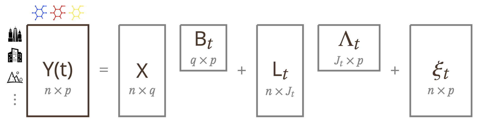

# BayesCausalFactor

In this repository, we provide the code for the novel model introduced in the paper <a href=https://arxiv.org/abs/2504.03480>_"Multivariate Causal Effects: a Bayesian Causal Regression Factor Model"_ </a> by D. Zorzetto, J. Landy, C. Zigler, G. Parmigiani, R. De Vito. 

We provide:
 - R functions for the Bayesian Causal Regression Factor Model
 - code to reproduce the simulation study
 - information to reproduce the application study: multivariate causal effects of wildfire smoke in chemical air polution
